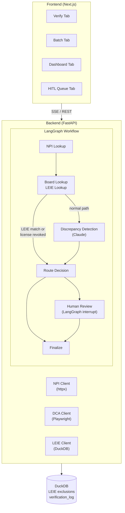
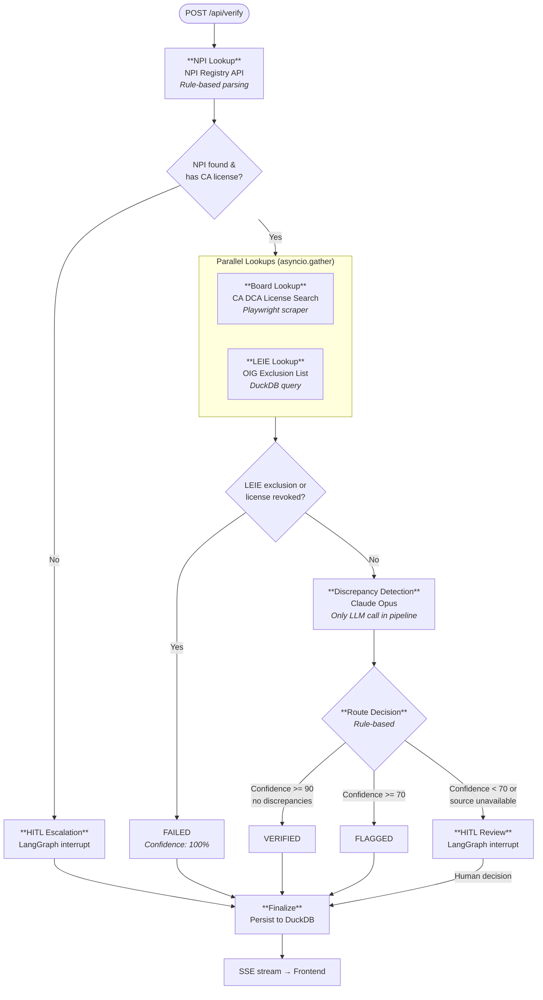

# CredentialMD - Physician Credentialing Verification Agent

A LangGraph-based AI agent that automates physician credentialing verification by orchestrating lookups across three public data sources: the NPI Registry API, the California DCA License Search, and the OIG LEIE exclusion list.

## Overview

This POC demonstrates:
- **Non-deterministic reasoning**: Claude Opus analyzing discrepancies across sources
- **Multi-source orchestration**: Parallel execution of NPI, DCA, and LEIE lookups
- **Human-in-the-loop escalation**: LangGraph interrupt mechanism for ambiguous cases
- **Operational monitoring**: Cost, latency, failure rates, and retry statistics

## Quick Start

```bash
# Run the setup and start script
./init.sh
```

This will:
1. Create a Python virtual environment
2. Install backend dependencies (FastAPI, LangGraph, DuckDB, Playwright)
3. Install frontend dependencies (Next.js, Tailwind, Recharts)
4. Initialize the DuckDB database with test data
5. Start both backend (port 8000) and frontend (port 3000)

## Mock Mode (Default)

The app ships with `CREDENTIALMD_MOCK_MODE=true` by default. In mock mode:

- **MockLLMProvider** returns realistic canned responses for discrepancy detection
- **Mock DCA** returns synthetic license data (no Playwright/CAPTCHA)
- **Test LEIE CSV** (`data/UPDATED_test.csv`) is used for exclusion checks
- **NPI API** can be called live (free, no auth) or mocked

Mock mode allows the entire pipeline to be tested and demoed without external dependencies.

## Architecture



## Verification Pipeline



## Architecture Highlights

**Single LLM call (skipped for auto-fails)** — Only the discrepancy detection step calls Claude. NPI parsing, routing, and LEIE lookups are all rule-based or database queries, keeping cost low (~$0.01-0.03/verification). LEIE exclusion matches and revoked licenses short-circuit the pipeline entirely — they skip the LLM call and fail immediately with 100% confidence.

**Three data sources, verified in parallel** — NPI Registry (REST API), CA DCA License Search (Playwright web scraper), OIG LEIE Exclusion List (DuckDB). Board + LEIE run concurrently via `asyncio.gather()`.

**Human-in-the-loop via LangGraph interrupt** — Ambiguous cases (low confidence, source unavailable, NPI issues) automatically pause the graph and appear in a review queue. Human decisions resume the workflow.

**Routing rules (no LLM):**

| Condition | Outcome |
|---|---|
| LEIE exclusion match | Auto-fail (skips LLM, confidence 100%) |
| License revoked | Auto-fail (skips LLM, confidence 100%) |
| Confidence >= 90, no discrepancies | Auto-verify |
| Confidence >= 70 | Flag for review |
| Confidence < 70 or source unavailable | Escalate to human |

**Real-time SSE streaming** — Frontend receives step-by-step status updates (npi_lookup → license_check → exclusion_check → analyzing → result) via Server-Sent Events.

**Mock mode ships by default** — Full pipeline testable without external dependencies (MockLLMProvider, synthetic DCA data, test LEIE CSV). Toggle to live with `CREDENTIALMD_MOCK_MODE=false`.

**Per-verification cost tracking** — Every verification logs LLM token usage, per-step latencies, retry counts, and estimated USD cost. Dashboard aggregates these into operational metrics.

## Project Structure

```
credentialmd-poc/
├── README.md
├── init.sh                    # Setup and run script
├── .env.example               # Environment configuration
├── data/
│   ├── UPDATED_test.csv       # Test LEIE data
│   └── test_physicians.csv    # Batch demo input
├── backend/
│   ├── main.py                # FastAPI entry point
│   ├── config.py              # Environment configuration
│   ├── db.py                  # DuckDB connection
│   ├── requirements.txt       # Python dependencies
│   ├── llm/
│   │   ├── provider.py        # LLM provider abstraction
│   │   └── mock_responses.py  # Mock LLM responses
│   ├── sources/
│   │   ├── npi.py             # NPI Registry client
│   │   ├── npi_mock_data.py   # Mock NPI responses
│   │   ├── dca.py             # CA DCA client
│   │   ├── dca_mock_data.py   # Mock DCA responses
│   │   └── leie.py            # LEIE DuckDB queries
│   ├── graph/
│   │   ├── state.py           # VerificationState dataclass
│   │   ├── nodes.py           # LangGraph node functions
│   │   ├── workflow.py        # Graph definition
│   │   └── hitl.py            # Human-in-the-loop handling
│   └── api/
│       ├── routes.py          # FastAPI routes
│       └── sse.py             # SSE helpers
└── frontend/
    ├── package.json
    ├── next.config.js
    ├── tailwind.config.js
    └── src/
        ├── app/
        │   ├── verify/        # Single verification
        │   ├── batch/         # Bulk verification
        │   ├── dashboard/     # Metrics & charts
        │   └── review/        # HITL queue
        └── components/
```

## API Endpoints

### Verification
- `POST /api/verify` - Start single verification
- `GET /api/verify/{id}` - Get verification status
- `GET /api/verify/{id}/stream` - SSE status updates
- `POST /api/verify/{id}/review` - Submit HITL decision

### Batch
- `POST /api/batch` - Start batch verification
- `GET /api/batch/{id}` - Get batch status
- `GET /api/batch/{id}/stream` - SSE per-physician updates
- `GET /api/batch/{id}/export` - Export results CSV

### Metrics
- `GET /api/metrics` - Aggregated statistics
- `GET /api/hitl/queue` - Pending human reviews

## Test Physicians

The `data/test_physicians.csv` contains 10 test cases covering all verification scenarios:

| NPI | Name | Expected Outcome |
|-----|------|------------------|
| 1003127655 | MOUSTAFA ABOSHADY | verified |
| 1588667638 | SARAH CHEN | verified |
| 1497758544 | JAMES WILLIAMS | verified |
| 1234567001 | ROBERT EXCLUDED | failed (LEIE) |
| 1234567002 | LISA BANNEDBERG | failed (LEIE) |
| (blank) | MARIA NOPI-EXCLUD | failed (LEIE) |
| 1111111111 | MICHAEL GHOSTDOC | escalated (no CA license) |
| 2222222222 | JENNIFER MISMATCH | flagged (name mismatch) |
| 3333333333 | DAVID EXPIREDLICENSE | flagged (expired) |
| 4444444444 | ANNA LOWCONFIDENCE | escalated (low confidence) |

## Design System

- **Primary**: #2563EB (blue-600, trust/medical)
- **Success**: #16A34A (green-600, verified)
- **Warning**: #D97706 (amber-600, flagged/review)
- **Danger**: #DC2626 (red-600, failed/excluded)
- **Escalated**: #7C3AED (violet-600, HITL)

## Development

### Backend Only
```bash
cd backend
source .venv/bin/activate
uvicorn main:app --reload
```

### Frontend Only
```bash
cd frontend
npm run dev
```

### Switching to Live Mode
```bash
# Edit .env
CREDENTIALMD_MOCK_MODE=false
```

Note: Live mode requires:
- Claude Code credentials (~/.claude/.credentials.json)
- Playwright Chromium installed
- Production LEIE CSV downloaded

## License

MIT
